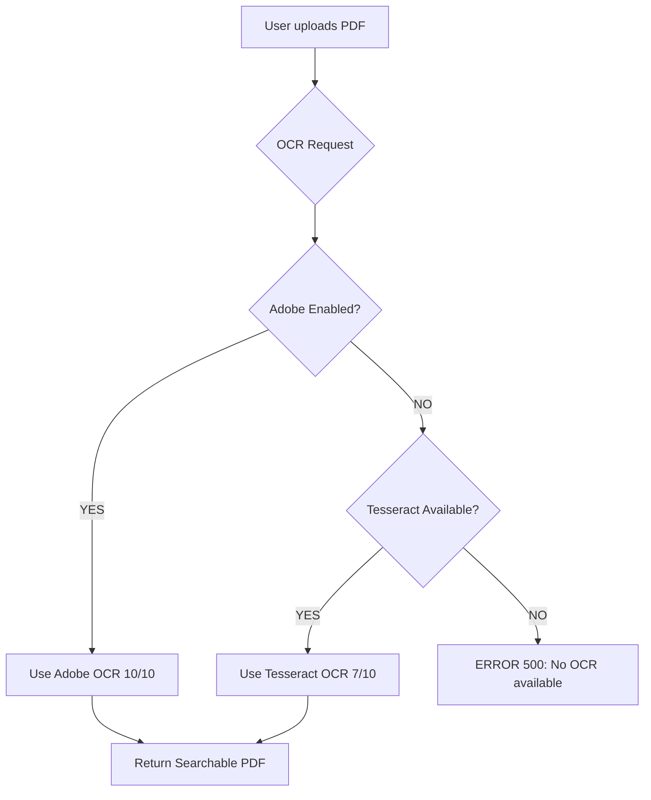

# 🎯 Adobe OCR - Workflow Tổng Quan

## ❓ Tại Sao OCR Đang Lỗi 400?

**Root Cause**: Adobe credentials chưa được cấu hình

```
POST /api/v1/documents/pdf/ocr → 400 Bad Request
```

**Hiện tại**: System fallback sang Tesseract nhưng Tesseract binary chưa install

---

## ✅ Solutions (Chọn 1 trong 2)

### 🌟 **Option 1: Dùng Adobe (Recommended - Best Quality)**

**Quality**: 10/10  
**Cost**: Free 500 transactions/month  
**Setup time**: 5 phút  

**Ưu điểm**:
- ✅ Perfect Vietnamese OCR
- ✅ Preserve original layout 100%
- ✅ Support 50+ languages
- ✅ AI-powered accuracy
- ✅ Cloud-based (không cần cài gì)

**Steps**:
1. Lấy credentials: https://acrobatservices.adobe.com
2. Update `backend/.env`:
   ```env
   USE_ADOBE_PDF_API=true
   PDF_SERVICES_CLIENT_ID="your_id"
   PDF_SERVICES_CLIENT_SECRET="your_secret"
   ```
3. Test: `python test_adobe_credentials.py`
4. Restart backend
5. ✅ Done!

📘 **Chi tiết**: Xem [ADOBE_CREDENTIALS_GUIDE.md](./ADOBE_CREDENTIALS_GUIDE.md)

---

### 💻 **Option 2: Dùng Tesseract (Free Alternative)**

**Quality**: 7/10  
**Cost**: 100% Free, unlimited  
**Setup time**: 10 phút  

**Ưu điểm**:
- ✅ Completely free
- ✅ Unlimited usage
- ✅ Offline (không cần internet)
- ✅ 100+ languages

**Nhược điểm**:
- ⚠️ Layout preservation không perfect
- ⚠️ Accuracy thấp hơn Adobe
- ⚠️ Cần cài Tesseract binary

**Steps**:

1. **Install Tesseract Binary**:
   ```powershell
   # Option A: Chocolatey (nhanh nhất)
   choco install tesseract
   
   # Option B: Download installer
   # https://github.com/UB-Mannheim/tesseract/wiki
   # Download và install: tesseract-ocr-w64-setup-v5.3.3.exe
   ```

2. **Install Vietnamese Language Data**:
   - Download: https://github.com/tesseract-ocr/tessdata/blob/main/vie.traineddata
   - Copy to: `C:\Program Files\Tesseract-OCR\tessdata\vie.traineddata`

3. **Verify Installation**:
   ```powershell
   tesseract --version
   # Should show: tesseract v5.x.x
   ```

4. **Restart Backend** - System sẽ tự động detect Tesseract

5. ✅ Done! OCR sẽ dùng Tesseract

---

## 🔄 Current System Behavior



**Current State**:
- ❌ Adobe: Disabled (no credentials)
- ❌ Tesseract: Not installed
- ➡️ Result: **500 Error**

---

## 📊 Comparison

| Feature | Adobe | Tesseract |
|---------|-------|-----------|
| **Quality** | 10/10 ⭐⭐⭐⭐⭐ | 7/10 ⭐⭐⭐ |
| **Speed** | Medium (API call) | Fast (local) |
| **Layout** | Perfect ✅ | Basic ⚠️ |
| **Cost** | 500 free/month | Unlimited ✅ |
| **Setup** | 5 min (easy) | 10 min (manual) |
| **Internet** | Required | Offline ✅ |
| **Languages** | 50+ | 100+ |
| **Vietnamese** | Perfect ✅ | Good ✅ |

---

## 🎯 Recommendation

**For Testing/Personal Use**: 
➡️ **Tesseract** (free, unlimited)

**For Production/Business**: 
➡️ **Adobe** (better quality, professional results)

**Best of Both**: 
➡️ Configure **Both** - Adobe first, Tesseract fallback
```env
USE_ADOBE_PDF_API=true
PDF_SERVICES_CLIENT_ID="your_id"
PDF_SERVICES_CLIENT_SECRET="your_secret"
# + Tesseract installed
```

System sẽ tự động:
- Try Adobe first (until quota exhausted)
- Fallback to Tesseract (if Adobe fails)

---

## 🚀 Quick Action

**Muốn test ngay?**

```powershell
# Install Tesseract (1 command)
choco install tesseract

# Restart backend
# Done! Try OCR again
```

**Muốn quality tốt nhất?**

1. Xem guide: `ADOBE_QUICK_SETUP.md`
2. Get credentials (2 phút): https://acrobatservices.adobe.com
3. Update `.env`
4. Done!

---

## 📞 Need Help?

- 📘 Full guide: `ADOBE_CREDENTIALS_GUIDE.md`
- ⚡ Quick setup: `ADOBE_QUICK_SETUP.md`
- 🧪 Test script: `python test_adobe_credentials.py`
- 📖 Adobe docs: https://developer.adobe.com/document-services

---

**TL;DR**: OCR cần Adobe credentials HOẶC Tesseract binary. Chọn 1 trong 2 options ở trên!
