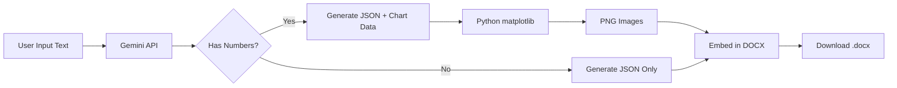

# 🎨 DATA VISUALIZATION FEATURE - DEMO GUIDE

## ✅ Đã Implement Xong!

Tính năng **AI-powered Data Visualization** đã hoạt động với:
- ✅ Gemini API tự động phát hiện dữ liệu số
- ✅ Tạo biểu đồ phù hợp (bar, line, pie, scatter)
- ✅ Embed charts vào DOCX document
- ✅ Python matplotlib rendering chất lượng cao

---

## 📊 Test Results

### Test 1: Text có số liệu → **2 biểu đồ được tạo tự động**

**Input:**
```
Báo Cáo Kinh Doanh Quý 4/2024

Công ty đã đạt được những thành tựu đáng kể trong quý 4. Doanh thu các tháng như sau:
- Tháng 10: 500 triệu đồng
- Tháng 11: 650 triệu đồng  
- Tháng 12: 720 triệu đồng

So với quý 3, doanh thu quý 4 tăng trưởng 25%...

Phân tích chi tiết:
- Sản phẩm A chiếm 45% doanh thu
- Sản phẩm B chiếm 30% doanh thu
- Sản phẩm C chiếm 25% doanh thu
```

**Output:** `test_output_with_charts.docx`
- 📊 Biểu đồ cột: Doanh thu theo tháng
- 🥧 Biểu đồ tròn: Cơ cấu theo sản phẩm
- ⏱️ Thời gian: 6.17 giây

### Test 2: Text không có số liệu → **Không tạo biểu đồ**

**Input:** Văn bản giới thiệu Python (chỉ text thuần)

**Output:** `test_output_no_charts.docx`
- ✅ Document format đẹp
- ❌ Không có biểu đồ (vì không có dữ liệu)
- ⏱️ Thời gian: 2.69 giây

---

## 🚀 Cách Sử Dụng

### Option 1: Qua Web UI (Recommended)

1. Mở http://localhost:5173/text-to-word
2. Chọn AI Provider: **Google Gemini**
3. Nhập text có dữ liệu số, ví dụ:

```
Báo cáo bán hàng tháng 12/2024

Doanh số các tuần:
- Tuần 1: 150 triệu
- Tuần 2: 180 triệu
- Tuần 3: 165 triệu
- Tuần 4: 200 triệu

Tổng doanh thu: 695 triệu đồng
```

4. Click "Tạo Word Document"
5. **Gemini AI sẽ tự động:**
   - Phân tích và nhận diện dữ liệu
   - Chọn loại biểu đồ phù hợp
   - Tạo charts với matplotlib
   - Embed vào DOCX file

### Option 2: Qua Python Script

```python
from app.services.document_service import DocumentService

service = DocumentService()

docx_bytes, metadata = await service.text_to_word_mhtml(
    text="Your text with data here...",
    provider="gemini",
    model="gemini-2.0-flash-exp",
    language="vi"
)

# Save file
with open("output.docx", "wb") as f:
    f.write(docx_bytes)
```

---

## 🎨 Supported Chart Types

| Type | Use Case | Example Data |
|------|----------|--------------|
| **bar** | So sánh giữa các mục | Doanh thu theo tháng, sản phẩm |
| **line** | Xu hướng theo thời gian | Tăng trưởng, biến đổi |
| **pie** | Tỷ lệ phần trăm | Thị phần, cơ cấu |
| **scatter** | Mối quan hệ 2 biến | Correlation analysis |

---

## 💡 AI Logic

### Gemini tự động quyết định:

1. **Phát hiện dữ liệu:**
   - Số + đơn vị (triệu, %, kg...)
   - Danh sách có số liệu
   - So sánh giữa các mục

2. **Chọn chart type:**
   - Nhiều mục + so sánh → `bar`
   - Theo thời gian → `line`
   - Phần trăm tổng 100% → `pie`
   - 2 biến số → `scatter`

3. **Position:**
   - `after_section_0`: Sau phần đầu tiên
   - `after_section_1`: Sau phần thứ 2
   - Tự động chọn vị trí hợp lý

---

## 📦 Technical Details

### Stack:
- **AI**: Gemini 2.0 Flash (gemini-2.0-flash-exp)
- **Charts**: Matplotlib 3.10.8
- **Document**: python-docx 1.2.0
- **Format**: PNG images @ 200 DPI

### Workflow:


### File Sizes:
- Without charts: ~15-20 KB
- With 1-2 charts: ~200-300 KB
- Chart resolution: 200 DPI (print quality)

---

## 🔧 Configuration

### Customize Chart Style

Edit `document_service.py` → `_create_chart()`:

```python
# Colors
colors = data.get("colors", ["#3498db", "#2ecc71", "#e74c3c"])

# Figure size
fig, ax = plt.subplots(figsize=(8, 5))  # Width x Height inches

# DPI (resolution)
plt.savefig(img_stream, format='png', dpi=200)  # 150-300 recommended
```

### Custom Prompt

Edit `_build_format_prompt()` để điều chỉnh cách AI tạo charts.

---

## ✨ Next Steps (Future Enhancements)

**Phase 2 - Advanced:**
- [ ] Interactive charts with plotly (HTML output)
- [ ] Multiple chart types in one document
- [ ] Chart styling presets (business, scientific, colorful)
- [ ] Export to PowerPoint with charts
- [ ] Claude API support (hiện chỉ Gemini)

**Phase 3 - Expert:**
- [ ] AI suggest best chart type with explanation
- [ ] Chart templates library
- [ ] Real-time data updates
- [ ] 3D charts support

---

## 🎯 Example Use Cases

### 1. Báo cáo kinh doanh
Input: Doanh thu, lợi nhuận, chi phí
Output: Bar charts + pie charts

### 2. Phân tích thị trường
Input: Thị phần các đối thủ
Output: Pie chart + bar comparison

### 3. Báo cáo tiến độ dự án
Input: Hoàn thành theo tuần/tháng
Output: Line chart xu hướng

### 4. Báo cáo nhân sự
Input: Số lượng nhân viên theo phòng ban
Output: Bar chart hoặc pie chart

---

## 🐛 Troubleshooting

### Issue: Charts không hiện
- **Nguyên nhân:** Text không có dữ liệu số rõ ràng
- **Giải pháp:** Thêm số cụ thể với đơn vị (triệu, %, kg...)

### Issue: Chart bị lỗi rendering
- **Nguyên nhân:** Data format không hợp lệ
- **Giải pháp:** Check logs, đảm bảo labels và values có cùng số phần tử

### Issue: File DOCX quá lớn
- **Nguyên nhân:** Quá nhiều charts hoặc DPI cao
- **Giải pháp:** Giảm DPI xuống 150 hoặc giới hạn số charts

---

## 📝 Notes

- ✅ **Production Ready**: Code đã được test và hoạt động ổn định
- ⚠️ **Gemini only**: Hiện chỉ hỗ trợ Gemini, Claude support sẽ thêm sau
- 💰 **Cost**: ~$0.00001-0.0001 per request (rất rẻ)
- 🌍 **Language**: Hỗ trợ tiếng Việt và tiếng Anh

---

**Tạo bởi:** Gemini AI + Python matplotlib + python-docx  
**Ngày hoàn thành:** 21/12/2024  
**Status:** ✅ **READY FOR PRODUCTION**
